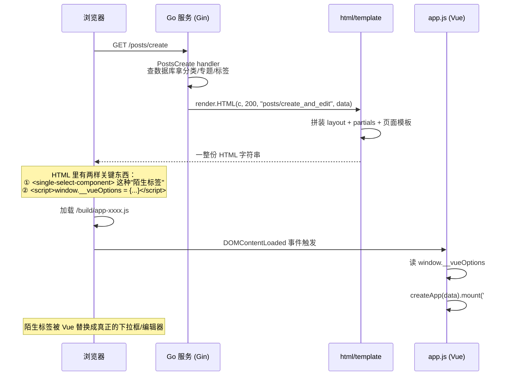
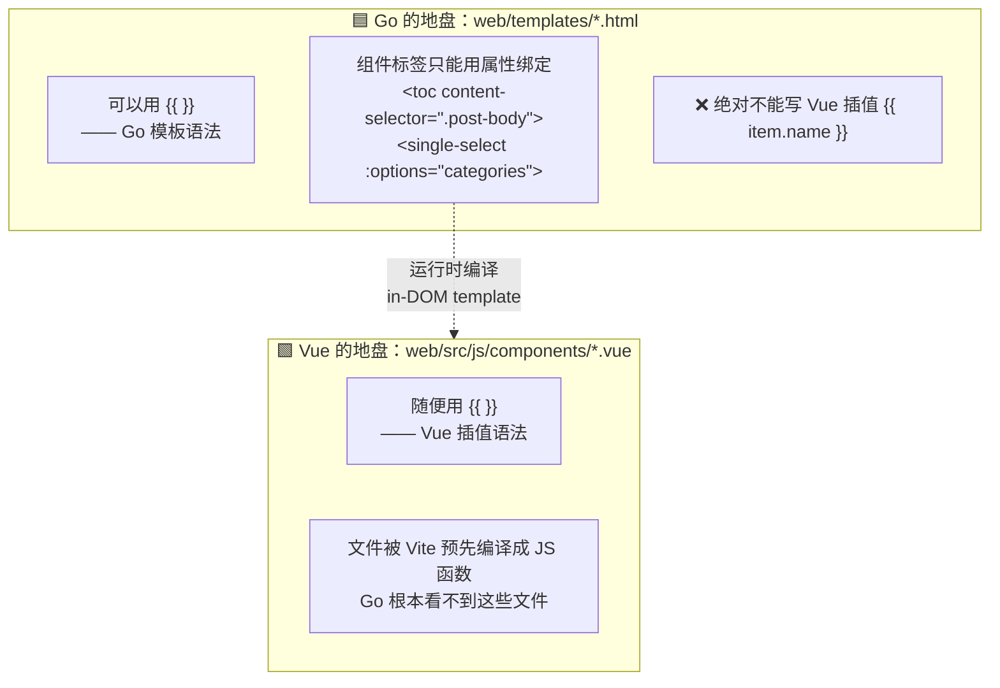
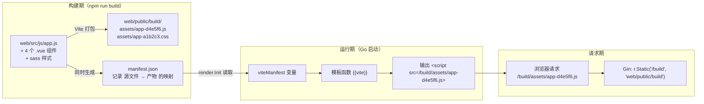
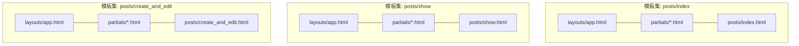

# Go 模板 + Vue 3 是怎么结合的

> 这篇文档用大白话 + 图，讲清楚本项目的前端架构。
> 看完你应该能回答：**页面上的下拉框、Markdown 编辑器、文章目录，是谁渲染出来的？数据怎么进去的？又怎么提交回来？**

---

## 0. 先建立一个总体印象

先说结论，只有一句话：

> **页面的 HTML 由 Go 生成，Vue 只负责"抠出来的几个小块"。**

这既不是"前后端分离的 SPA"，也不是"纯服务端渲染"，而是中间路线，业内一般叫 **"撒点式（sprinkles）"** 或 **"孤岛式（islands）"** 架构。

用一张图对比三种模式，你就明白我们在哪个位置：

```
【A. 纯服务端渲染】          【B. 本项目：撒点式】         【C. 前后端分离 SPA】

浏览器请求 /posts/create    浏览器请求 /posts/create      浏览器请求 /
       ↓                          ↓                            ↓
  Go 返回完整 HTML            Go 返回完整 HTML             返回一个空壳 index.html
       ↓                          ↓                            ↓
  浏览器直接显示             Vue 接管其中一个 <form>       Vue 渲染整个页面
                                  ↓                            ↓
  （没有 Vue）              其余部分还是 Go 的 HTML       再发 AJAX 去要 JSON 数据
```

**为什么选 B？**
因为这个项目是从 Laravel + Blade 迁移过来的，原来就是这个套路：大部分页面（首页、文章列表、文章详情）没有复杂交互，服务端直接吐 HTML 最简单最快、SEO 也好；但"发布文章"页面有富文本编辑器、可搜索可创建的标签选择器，这些用原生 JS 写太痛苦，就交给 Vue 组件。

---

## 1. 一次页面请求的完整旅程

以**访问"发布文章"页**为例，走一遍全流程。



### 关键点：浏览器最初收到的 HTML 长什么样？

Go 吐出来的 HTML（简化版）大概是这样的：

```html
<head>
  <!-- 由 {{vite "src/js/app.js"}} 生成 -->
  <link rel="stylesheet" href="/build/assets/app-a1b2c3.css">
  <script type="module" src="/build/assets/app-d4e5f6.js"></script>
</head>
<body>
  <form id="vue-app" action="/posts" method="post">   <!-- ← Vue 的挂载点 -->
    <input type="hidden" name="_token" value="随机CSRF串">
    <input type="text" name="title" value="">          <!-- 普通输入框，Go 渲染 -->

    <!-- ↓ 这三个标签浏览器根本不认识，暂时什么都不显示 -->
    <single-select-component name="category_id" :options="categories"></single-select-component>
    <multi-select-component  name="tag_ids"     :options="tags"></multi-select-component>
    <simple-mde-component    name="body"        :initial="form.body"></simple-mde-component>

    <button type="submit">发布</button>
  </form>

  <!-- ↓ Go 把数据库里的数据序列化成 JSON，塞进这个全局变量 -->
  <script>
    window.__vueOptions = {
      el: '#vue-app',
      data: {
        categories: [{"id":1,"name":"后端","icon":"icon-go"}, ...],
        tags:       [{"id":1,"name":"go"}, ...],
        form: { categoryId: 0, tagIds: [], body: "" }
      }
    };
  </script>
</body>
```

有几秒钟的时间，页面上那三个位置是空白的（这叫"未激活状态"）。等 `app.js` 下载执行完，Vue 一挂载，空白处才变成漂亮的下拉框和编辑器。

---

## 2. 两边的"接口"只有一个：`window.__vueOptions`

Go 和 Vue 是两个完全独立的世界，它们之间**唯一的约定**就是这个全局变量。可以把它理解为"点单小票"。

```
        Go 侧（写小票）                          JS 侧（照单干活）
┌──────────────────────────────┐      ┌────────────────────────────────┐
│ web/templates/posts/         │      │ web/src/js/app.js              │
│   create_and_edit.html       │      │                                │
│                              │      │ const opts = window.__vueOptions│
│ {{define "scripts"}}         │─────▶│ if (opts && opts.el) {         │
│ window.__vueOptions = {      │      │   createApp({ data() {         │
│   el:   '#vue-app',   ←哪块DOM│      │     return opts.data           │
│   data: { ... }       ←什么数据│      │   }}).mount(opts.el)          │
│ }                            │      │ }                              │
│ {{end}}                      │      │                                │
└──────────────────────────────┘      └────────────────────────────────┘
```

**这套设计的好处**：Go 完全不需要知道 Vue 的存在，它只是"输出一段 JSON"；Vue 也不需要知道路由、数据库，它只认这一个变量。两边解耦得非常干净。

**副作用**：因为是单个全局变量，**一个页面只能挂一个 Vue 根实例**。目前正好够用：

| 页面模板 | `el` | 挂载了什么 |
|---|---|---|
| `posts/create_and_edit.html` | `#vue-app`（就是那个 `<form>`） | 下拉框 ×2、多选框、Markdown 编辑器 |
| `posts/show.html` | `#vue-app`（右侧栏一个 div） | 文章目录 `<toc>` |
| 其他所有页面 | 不设置 | 没有 Vue，只跑纯 JS（代码高亮 / 回到顶部 / 评论展开） |

> ⚠️ 如果哪天某个页面需要在两个不相邻的地方各挂一个组件，就得把 `__vueOptions` 从"一个对象"改成"数组"。这是当前设计的一个已知天花板。

---

## 3. 数据怎么进去的？—— `{{json}}` 模板函数

Go 的数据是结构体，JS 需要的是 JSON。中间的转换靠一个自定义模板函数：

```go
// internal/render/render.go
"json": jsonEncode,

func jsonEncode(v interface{}) template.JS {
    b, err := json.Marshal(v)
    if err != nil { return "null" }
    return template.JS(b)   // 标记为"可安全嵌入 JS 的内容"
}
```

用法和效果：

```
模板写法                        →  实际输出到 HTML 的内容
─────────────────────────────────────────────────────────────
{{json .formCategories}}        →  [{"id":1,"name":"后端"},{"id":2,"name":"前端"}]
{{json .post.CategoryID}}       →  3
{{json .postTagIDs}}            →  [1,5,9]
{{json .post.Body}}             →  "# 标题\n正文..."
```

注意返回的是 `template.JS` 类型而不是 `string`。这是 Go 模板的**上下文自动转义**机制：如果返回普通字符串，Go 会把 `"` 转义成 `&#34;`，塞进 `<script>` 里就变成语法错误了。标记成 `template.JS` 就是告诉 Go "这段内容我保证是合法 JS，别动它"。

同理 `render.go` 里还有一组 `safe*` 函数，各管一个位置：

| 函数 | 用在哪 | 例子 |
|---|---|---|
| `safe` | HTML 正文 | `{{.about \| safe}}` 输出富文本 |
| `safeattr` | 标签属性 | |
| `safejs` | `<script>` 内 | |
| `safeurl` | `href` / `src` | `{{. \| safeurl}}` |
| `safecss` | `<style>` 内 | `--main-color: {{... \| safecss}}` |
| `json` | `<script>` 内的数据 | 上面讲的 |

---

## 4. 最大的坑：`{{ }}` 撞车了

Go 模板用 `{{ }}`，Vue 模板**也**用 `{{ }}`。同一个 HTML 文件里，谁来解释这对花括号？

**答案：Go 先执行，所以 Go 全赢。** Vue 拿到的是 Go 处理完的结果，`{{ msg }}` 早就被 Go 当成"找不到的变量"处理掉了。

项目的解决办法不是改定界符，而是**划清地盘**：



所以你会看到 `app.js` 里那句注释：

```js
// in-DOM 模板不使用插值语法（与 Go 模板冲突），仅用属性绑定
app.mount(opts.el)
```

**衍生的一个配置**：因为组件标签是直接写在 HTML 页面里的（术语叫 in-DOM template），Vue 必须在浏览器里现场编译它们，所以要引入"带编译器的完整版 Vue"：

```js
// web/vite.config.js
resolve: {
  alias: { vue: 'vue/dist/vue.esm-bundler.js' }   // 默认版本不含编译器，会报错
}
```

> 💡 **小知识**：`.vue` 文件里的 `{{ }}` 之所以安全，是因为 Vite 在打包阶段就把 `<template>` 编译成了 `render()` 函数，最终产物里已经没有花括号了。

---

## 5. 数据怎么提交回来？—— 走原生表单，不发 AJAX

这是本项目最"复古"也最省事的一点：**Vue 组件不负责发请求**，它只负责把值同步到一个原生表单控件里，剩下的交给浏览器默认的表单提交。

```
┌─────────────────────────────────────────────────────────────────┐
│  <form id="vue-app" action="/posts" method="post">              │
│                                                                 │
│  ┌───────────────────────────────────────────────────┐         │
│  │ <single-select-component name="category_id">      │         │
│  │                                                   │         │
│  │   用户看到 → [ 后端 ▾ ]  漂亮的可搜索下拉框        │         │
│  │                   ↕ v-model                        │         │
│  │   实际提交 → <input type="hidden"                  │         │
│  │                     name="category_id" value="3">  │  ←关键！ │
│  └───────────────────────────────────────────────────┘         │
│                                                                 │
│  ┌───────────────────────────────────────────────────┐         │
│  │ <simple-mde-component name="body">                │         │
│  │                                                   │         │
│  │   用户看到 → EasyMDE 富文本编辑器（工具栏+预览）    │         │
│  │                   ↕ forceSync: true                │         │
│  │   实际提交 → <textarea name="body">...</textarea>  │  ←关键！ │
│  └───────────────────────────────────────────────────┘         │
│                                                                 │
│  <input type="hidden" name="_token" value="CSRF...">  ← Go 渲染 │
│  <button type="submit">发布</button>                            │
└─────────────────────────────────────────────────────────────────┘
                              │
                              │ 点击提交 → 浏览器原生 POST（form-urlencoded）
                              ▼
              Go handler: c.PostForm("category_id") / c.PostForm("body")
```

每个组件内部都藏着一个"影子控件"：

| 组件 | 影子控件 | 同步机制 |
|---|---|---|
| `SingleSelectComponent` | `<input type="hidden" :value="value">` | Vue 的 `:value` 绑定 |
| `MultiSelectComponent` | `<input type="hidden" :value="valueJson">` | 多个值序列化成 JSON 字符串 |
| `SimpleMdeComponent` | `<textarea :name="name">` | EasyMDE 的 `forceSync: true` |

**这么做的好处**：不用写任何 AJAX 代码，不用处理 loading/错误状态，CSRF 也是模板直接渲染的隐藏字段，服务端就是最普通的 `c.PostForm(...)`，和处理任何普通表单没区别。

### 附带一个巧妙的小约定

标签/专题的选择器支持"输入新名称直接创建"。前端不知道新记录的 ID（还没入库），于是约定用 `名称~随机串` 当临时 ID：

```js
// SingleSelectComponent.vue / MultiSelectComponent.vue
handleCreate(option) {
  return { name: option.name, id: option.name + '~' + Math.random().toString(36).substring(2) }
}
```

服务端一看到值里带 `~`，就知道这是新建的：

```go
// internal/services/post.go
if strings.Contains(in.TopicID, "~") {
    topic := models.Topic{Name: strings.SplitN(in.TopicID, "~", 2)[0]}  // 取 ~ 前面的名字
    tx.Create(&topic)      // 先创建
    post.TopicID = topic.ID
}
```

---

## 6. JS/CSS 文件是怎么被引进来的？

Vite 打包后的文件名带 hash（`app-d4e5f6.js`），每次构建都变，模板里没法写死。解决办法是 Vite 生成一份"文件名清单"（manifest），Go 启动时读取它。



整个页面的资源引入，在布局文件里只占**一行**：

```html
<!-- web/templates/layouts/app.html -->
{{vite "src/js/app.js"}}
```

### 开发模式 vs 生产模式

`{{vite}}` 这个函数会看环境变量，输出两种完全不同的东西：

```
VITE_DEV=false（生产）                    VITE_DEV=true（开发）
─────────────────────────────────         ─────────────────────────────────
查 manifest.json，输出：                   忽略 manifest，直接指向 Vite dev server：

<link rel="stylesheet"                    <script type="module"
      href="/build/assets/app-a1b2.css">        src="http://localhost:5173/@vite/client">
<script type="module"                     <script type="module"
      src="/build/assets/app-d4e5.js">          src="http://localhost:5173/src/js/app.js">

→ 由 Gin 提供静态文件                      → 由 Vite 提供，改代码浏览器自动热更新（HMR）
```

对应的开发流程（`.env.example` 里也有注释）：

```bash
# 终端 1：起 Vite dev server，负责编译 .vue / .scss，支持热更新
cd web; npm run dev

# 终端 2：起 Go 服务，注意 .env 里要设 VITE_DEV=true
go run ./cmd/server
```

上线前记得 `cd web; npm run build`，并把 `VITE_DEV` 改回 `false`。

---

## 7. 模板系统本身是怎么组织的

顺带说清楚 Go 这边的模板结构，因为它决定了 `{{define "scripts"}}` 为什么能生效。

```
web/templates/
├── layouts/app.html        ← 骨架：<html><head>...<body>，全站共用
├── partials/               ← 可复用片段：header / sidebar / comments / messages
│   ├── header.html
│   └── common.html
├── posts/
│   ├── index.html          ← 页面模板
│   ├── show.html
│   └── create_and_edit.html
└── admin/ auth/ users/ ...
```

`render.New()` 的加载策略是：**遍历目录，`layouts/` 和 `partials/` 归为"共享模板"，其余每个 `.html` 都是一个"页面"；然后为每个页面单独建一个模板集 = 全部共享模板 + 它自己。**



为什么要一页一个集合？因为 Go 模板里同名的 `define` 会互相覆盖。每个页面都定义了自己的 `"content"`、`"title"`、`"scripts"`，放在同一个集合里就冲突了。分开建集合，各自的 `block` 才能被正确填充：

```
layouts/app.html 里挖了三个"坑"：            页面模板负责"填坑"：
{{block "title"   .}}默认标题{{end}}   ←──   {{define "title"}}发布文章{{end}}
{{block "content" .}}{{end}}           ←──   {{define "content"}}<form>...{{end}}
{{block "scripts" .}}{{end}}           ←──   {{define "scripts"}}window.__vueOptions=...{{end}}
```

渲染时统一执行 `layouts/app`：

```go
t.ExecuteTemplate(c.Writer, "layouts/app", data)
```

### 数据从哪来

`render.HTML` 会把两部分数据合并：

```
handler 传入的 data              中间件注入的全局数据
{post, formCategories, ...}      {siteConfigs, currentUser, sidebar, flash, csrfToken, routeClass}
            │                                        │
            └──────────────┬─────────────────────────┘
                           ▼
                合并（handler 的优先，不覆盖已有 key）
                           ▼
                   模板里统一用 {{.xxx}} 访问
```

全局数据由 `middleware.Globals()` 塞进 gin context 的 `view_globals`，这样每个页面都不用手动传站点配置、当前登录用户、侧边栏这些东西。

---

## 8. 一页速查表

```
┌──────────────────────────────────────────────────────────────────────────┐
│  文件                                     职责                            │
├──────────────────────────────────────────────────────────────────────────┤
│  internal/render/render.go               模板引擎 + 模板函数 + manifest 解析│
│  internal/middleware/middleware.go       注入全站共用数据 view_globals     │
│  web/templates/layouts/app.html          页面骨架，一行 {{vite}} 引资源    │
│  web/templates/**/*.html                 各页面 HTML，写 __vueOptions      │
│  web/src/js/app.js                       前端总入口，读 __vueOptions 挂 Vue│
│  web/src/js/components/*.vue             4 个 Vue 组件                     │
│  web/vite.config.js                      打包配置，产物进 public/build     │
│  internal/router/router.go               r.Static("/build", ...) 提供产物  │
└──────────────────────────────────────────────────────────────────────────┘

记住三条规矩就不会写错：
  ①  模板里的组件标签只能用属性绑定，绝对不要写 {{ }} 插值
  ②  往 JS 里传数据一律用 {{json .xxx}}，不要手写字符串拼接
  ③  组件的值必须落到一个带 name 的原生控件上，否则表单提交不上去
```

---

## 9. 常见疑问

**Q：为什么不干脆做成前后端分离的 SPA？**
博客是内容型站点，SEO 和首屏速度很重要，服务端直出 HTML 天然占优；而且要交互的地方只有"发文章"一个页面，为它引入整套 SPA（路由、状态管理、鉴权、API 层）不划算。

**Q：为什么组件里能用 `{{ }}`，页面里不行？**
`.vue` 文件由 Vite 在打包时编译，产物是 JS 函数，Go 从头到尾没见过这些花括号。页面 HTML 是 Go 亲手渲染的，花括号会被它抢先解释。

**Q：页面刚打开时下拉框位置是空的，正常吗？**
正常。那是 Vue 还没挂载完。如果觉得闪烁明显，可以给容器加个占位骨架样式。

**Q：我想加个新的 Vue 组件，要改哪几处？**
1. 新建 `web/src/js/components/XxxComponent.vue`
2. 在 `web/src/js/app.js` 里 `import` 并 `app.component('xxx-component', XxxComponent)`
3. 在页面模板里写 `<xxx-component :prop="dataKey">`（只用属性绑定！）
4. 如果需要服务端数据，在该页面的 `{{define "scripts"}}` 里加进 `__vueOptions.data`
5. 如果要参与表单提交，组件内部记得渲染带 `name` 的 hidden input
6. `cd web; npm run build`

**Q：改了 `.vue` 文件页面没变化？**
生产模式下必须重新 `npm run build`（并重启 Go 让它重读 manifest）；开发模式下确认 `VITE_DEV=true` 且 Vite dev server 在跑。
